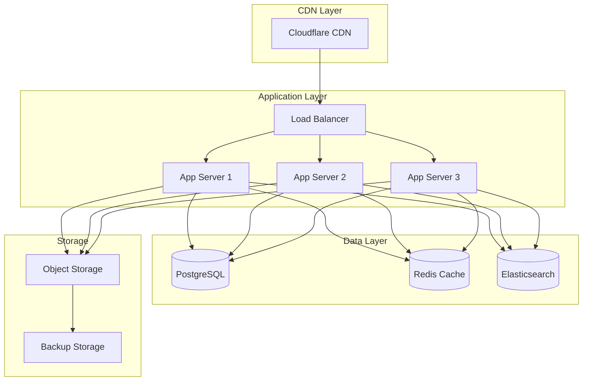

# Hatago Plugin Marketplace Roadmap

## Vision Statement

Build a comprehensive plugin marketplace ecosystem for Hatago MCP servers that enables seamless discovery, distribution, and management of community-created plugins. The marketplace will serve as the central hub for the Hatago ecosystem, fostering innovation and collaboration among developers.

## Table of Contents

- [Current State (Phase 1)](#current-state-phase-1)
- [Future Marketplace (Phase 2)](#future-marketplace-phase-2)
- [Implementation Timeline](#implementation-timeline)
- [Technical Architecture](#technical-architecture)
- [Feature Specifications](#feature-specifications)
- [User Experience](#user-experience)
- [Business Model](#business-model)
- [Success Metrics](#success-metrics)

## Current State (Phase 1)

### GitHub-Based Distribution

- **Discovery**: GitHub search API with topic filtering
- **Installation**: CLI commands with repository URLs
- **Versioning**: Git tags and GitHub releases
- **Metadata**: `hatago.plugin.json` files in repositories
- **Documentation**: README files and repository wikis

### Limitations

- Limited search capabilities
- No centralized metadata
- Manual quality control
- No user reviews or ratings
- Basic security validation

## Future Marketplace (Phase 2)

### Centralized Registry

A comprehensive platform that provides:

- Enhanced plugin discovery
- Automated quality assurance
- Community features
- Developer analytics
- Enterprise features

### Key Components

1. **Registry Server** - Plugin metadata and distribution
2. **Web Interface** - Marketplace frontend
3. **CLI Integration** - Enhanced command-line tools
4. **Developer Portal** - Publishing and analytics dashboard
5. **Community Platform** - Reviews, discussions, and support

## Implementation Timeline

### Phase 2.1: Registry Infrastructure (4 weeks)

#### Week 1: Core Registry Server

- **Registry API Design**
  - RESTful API for plugin operations
  - GraphQL API for complex queries
  - Authentication and authorization
  - Rate limiting and caching

- **Database Schema**

  ```sql
  -- Plugins table
  CREATE TABLE plugins (
    id UUID PRIMARY KEY,
    name VARCHAR(255) UNIQUE NOT NULL,
    display_name VARCHAR(255) NOT NULL,
    description TEXT NOT NULL,
    author_id UUID NOT NULL,
    repository_url VARCHAR(500),
    homepage_url VARCHAR(500),
    license VARCHAR(100) NOT NULL,
    keywords TEXT[],
    categories TEXT[],
    created_at TIMESTAMP DEFAULT NOW(),
    updated_at TIMESTAMP DEFAULT NOW()
  );

  -- Plugin versions table
  CREATE TABLE plugin_versions (
    id UUID PRIMARY KEY,
    plugin_id UUID REFERENCES plugins(id),
    version VARCHAR(50) NOT NULL,
    changelog TEXT,
    download_url VARCHAR(500) NOT NULL,
    metadata JSONB NOT NULL,
    published_at TIMESTAMP DEFAULT NOW(),
    deprecated BOOLEAN DEFAULT FALSE
  );

  -- Download statistics
  CREATE TABLE download_stats (
    id UUID PRIMARY KEY,
    plugin_id UUID REFERENCES plugins(id),
    version_id UUID REFERENCES plugin_versions(id),
    downloads_total INTEGER DEFAULT 0,
    downloads_weekly INTEGER DEFAULT 0,
    last_updated TIMESTAMP DEFAULT NOW()
  );
  ```

- **Storage System**
  - Cloudflare R2 or AWS S3 for plugin packages
  - CDN distribution for fast downloads
  - Backup and redundancy

#### Week 2: Authentication & Security

- **User Management**
  - GitHub OAuth integration
  - API key generation
  - Role-based access control
  - Organization support

- **Security Features**
  - Plugin signing and verification
  - Automated security scanning
  - Malware detection
  - Vulnerability reporting

- **Publishing Workflow**
  ```mermaid
  graph TD
    A[Developer submits plugin] --> B[Automated validation]
    B --> C[Security scan]
    C --> D[Manual review queue]
    D --> E[Approved]
    D --> F[Rejected with feedback]
    E --> G[Published to marketplace]
    F --> H[Developer notification]
  ```

#### Week 3: Search & Discovery

- **Full-text Search**
  - Elasticsearch/OpenSearch integration
  - Fuzzy matching and typo tolerance
  - Faceted search (categories, licenses, etc.)
  - Relevance scoring

- **Recommendation Engine**
  - Related plugin suggestions
  - Popular plugins by category
  - Trending plugins
  - Personalized recommendations

- **API Endpoints**

  ```typescript
  interface SearchAPI {
    // Search plugins
    GET /api/plugins/search?q=weather&category=apis&limit=20

    // Get plugin details
    GET /api/plugins/{pluginId}

    // List plugin versions
    GET /api/plugins/{pluginId}/versions

    // Download plugin
    GET /api/plugins/{pluginId}/versions/{version}/download
  }
  ```

#### Week 4: CLI Integration

- **Enhanced CLI Commands**

  ```bash
  # Search marketplace
  hatago search weather --category apis
  hatago search "database connector" --sort downloads

  # Show plugin details
  hatago info weather-api
  hatago info weather-api --version 1.2.0

  # Install from marketplace
  hatago install weather-api
  hatago install weather-api@1.2.0

  # Login to marketplace
  hatago auth login
  hatago auth whoami

  # Publish plugin
  hatago publish
  hatago publish --tag beta
  ```

- **Configuration Management**
  ```json
  {
    "registry": {
      "default": "https://registry.hatago.dev",
      "mirrors": ["https://registry-eu.hatago.dev", "https://registry-asia.hatago.dev"]
    },
    "auth": {
      "token": "...",
      "user": "johndoe"
    }
  }
  ```

### Phase 2.2: Web Interface (4 weeks)

#### Week 1: Frontend Foundation

- **Technology Stack**
  - Next.js 15 with App Router
  - TypeScript for type safety
  - Tailwind CSS for styling
  - shadcn/ui components
  - Framer Motion for animations

- **Core Pages**
  - Homepage with featured plugins
  - Search results page
  - Plugin detail page
  - Category browsing
  - User authentication

#### Week 2: Plugin Discovery

- **Search Interface**

  ```typescript
  interface SearchFilters {
    query?: string
    categories?: string[]
    licenses?: string[]
    compatibility?: string
    sortBy?: 'relevance' | 'downloads' | 'updated' | 'created'
    verified?: boolean
  }
  ```

- **Plugin Cards**
  - Plugin name and description
  - Author information
  - Download statistics
  - Rating and reviews
  - Compatibility badges
  - Last updated date

#### Week 3: Plugin Details & Installation

- **Plugin Detail Page**
  - Comprehensive overview
  - Installation instructions
  - Configuration examples
  - API documentation
  - Changelog and versions
  - Dependencies and requirements

- **Interactive Installation**
  - One-click install buttons
  - Configuration wizard
  - Environment setup guide
  - Troubleshooting help

#### Week 4: User Experience

- **Developer Dashboard**
  - Plugin management
  - Upload and publish workflow
  - Analytics and metrics
  - User feedback
  - Revenue tracking (future)

- **Community Features**
  - User reviews and ratings
  - Q&A sections
  - Usage examples
  - Community discussions

### Phase 2.3: Advanced Features (4 weeks)

#### Week 1: Analytics & Monitoring

- **Plugin Analytics**
  - Download statistics
  - Usage metrics
  - Error reporting
  - Performance monitoring
  - Geographic distribution

- **Dashboard Metrics**
  ```typescript
  interface PluginMetrics {
    downloads: {
      total: number
      weekly: number
      monthly: number
      trend: number
    }
    ratings: {
      average: number
      total: number
      distribution: Record<string, number>
    }
    compatibility: {
      versions: string[]
      success_rate: number
    }
  }
  ```

#### Week 2: Enterprise Features

- **Organization Support**
  - Team management
  - Private registries
  - Enterprise SSO
  - Audit logging
  - Compliance reporting

- **Advanced Security**
  - Vulnerability scanning
  - Security advisories
  - Access control policies
  - IP restrictions
  - Audit trails

#### Week 3: Developer Tools

- **SDK and Tools**
  - Plugin development SDK
  - Testing frameworks
  - Documentation generators
  - CI/CD integrations
  - Local development tools

- **GitHub Integration**
  - Automated publishing from releases
  - Status checks and validation
  - Issue synchronization
  - README synchronization

#### Week 4: Ecosystem Integration

- **IDE Extensions**
  - VS Code extension for plugin management
  - IntelliJ IDEA plugin
  - Plugin development snippets
  - Debugging support

- **Third-party Integrations**
  - Docker registry support
  - Kubernetes Helm charts
  - Cloud deployment tools
  - Monitoring integrations

### Phase 2.4: Community & Growth (4 weeks)

#### Week 1: Community Platform

- **Discussion Forums**
  - Plugin-specific discussions
  - General community topics
  - Developer Q&A
  - Feature requests
  - Bug reports

- **Documentation Hub**
  - Plugin development guides
  - Best practices
  - Architecture patterns
  - Security guidelines
  - Performance optimization

#### Week 2: Quality Assurance

- **Automated Testing**
  - Plugin compatibility testing
  - Security vulnerability scanning
  - Performance benchmarking
  - Documentation validation
  - Code quality metrics

- **Review Process**
  - Peer review system
  - Expert reviewer program
  - Quality badges
  - Certification levels
  - Compliance validation

#### Week 3: Marketing & Growth

- **Plugin Showcase**
  - Featured plugin campaigns
  - Developer spotlights
  - Success stories
  - Tutorial content
  - Webinar series

- **SEO & Discovery**
  - Search engine optimization
  - Social media integration
  - Plugin directory syndication
  - Newsletter campaigns

#### Week 4: Monetization & Sustainability

- **Revenue Models**
  - Premium plugin hosting
  - Enterprise subscriptions
  - Developer certification
  - Sponsored content
  - Marketplace commissions

- **Developer Incentives**
  - Revenue sharing program
  - Developer recognition
  - Conference speaking opportunities
  - Early access features
  - Premium support

## Technical Architecture

### Infrastructure



### Technology Stack

#### Backend

- **Runtime**: Node.js 20+ or Deno
- **Framework**: Fastify or Hono
- **Database**: PostgreSQL with connection pooling
- **Cache**: Redis for session and query caching
- **Search**: Elasticsearch or Meilisearch
- **Storage**: Cloudflare R2 or AWS S3
- **Queue**: BullMQ for background jobs

#### Frontend

- **Framework**: Next.js 15 with App Router
- **Language**: TypeScript
- **Styling**: Tailwind CSS
- **Components**: shadcn/ui
- **State**: Zustand or Jotai
- **Forms**: React Hook Form with Zod

#### Infrastructure

- **Hosting**: Cloudflare Workers or Vercel
- **Database**: PlanetScale or Supabase
- **CDN**: Cloudflare
- **Monitoring**: Datadog or New Relic
- **Error Tracking**: Sentry

## Feature Specifications

### Core Features

#### Plugin Discovery

- Full-text search with filters
- Category-based browsing
- Tag-based filtering
- Sorting by popularity, date, ratings
- Related plugin recommendations

#### Plugin Management

- Detailed plugin information
- Version history and changelogs
- Dependency visualization
- Installation instructions
- Configuration examples

#### User Management

- GitHub OAuth authentication
- User profiles and preferences
- Plugin collections and favorites
- Notification settings
- Privacy controls

### Advanced Features

#### Developer Tools

- Publishing workflow
- Analytics dashboard
- Automated testing integration
- Documentation generation
- Revenue tracking

#### Enterprise Features

- Private registries
- Organization management
- Enterprise SSO integration
- Audit logging
- Compliance reporting

#### Community Features

- Plugin reviews and ratings
- Discussion forums
- Q&A sections
- Developer profiles
- Success stories

## User Experience

### Developer Journey

1. **Discovery**
   - Land on marketplace homepage
   - Browse featured and popular plugins
   - Search for specific functionality
   - Read plugin documentation

2. **Installation**
   - View installation instructions
   - Copy CLI commands
   - Follow configuration guides
   - Test plugin functionality

3. **Development**
   - Create new plugin project
   - Use development tools
   - Test locally with Hatago
   - Submit for publication

4. **Publication**
   - Register developer account
   - Upload plugin package
   - Complete verification process
   - Monitor analytics and feedback

### User Personas

#### Plugin Developer

- Wants to share useful plugins
- Needs clear publishing process
- Values analytics and feedback
- Seeks recognition and community

#### System Integrator

- Searches for specific functionality
- Evaluates quality and compatibility
- Needs enterprise features
- Values support and documentation

#### Hobbyist User

- Explores available plugins
- Tries different solutions
- Participates in community
- Shares experiences and feedback

## Business Model

### Revenue Streams

1. **Freemium Model**
   - Free basic registry service
   - Premium features for developers
   - Enterprise subscriptions

2. **Marketplace Commission**
   - Percentage of paid plugin sales
   - Featured placement fees
   - Sponsored content

3. **Enterprise Services**
   - Private registry hosting
   - Custom integrations
   - Priority support
   - Training and consulting

### Cost Structure

- Infrastructure and hosting
- Development and maintenance
- Security and compliance
- Customer support
- Marketing and community

## Success Metrics

### Adoption Metrics

- Number of published plugins
- Active plugin developers
- Total plugin downloads
- Monthly active users
- Plugin rating distribution

### Quality Metrics

- Average plugin rating
- Plugin update frequency
- Security issue resolution time
- Documentation completeness
- Community engagement level

### Business Metrics

- Revenue growth
- Customer acquisition cost
- Developer retention rate
- Enterprise subscription rate
- Platform operational costs

## Migration Strategy

### From GitHub Distribution

1. **Backward Compatibility**
   - Continue supporting GitHub URLs
   - Automatic plugin detection
   - Metadata migration tools
   - Gradual feature rollout

2. **Developer Onboarding**
   - Import existing plugins
   - Streamlined publishing
   - Migration guides
   - Community support

3. **User Transition**
   - Side-by-side operation
   - Feature comparison
   - Migration incentives
   - Smooth transition tools

### Data Migration

- Plugin metadata extraction
- Version history preservation
- Download statistics migration
- User preference transfer
- Review and rating import

## Risk Mitigation

### Technical Risks

- Scalability challenges
- Security vulnerabilities
- Performance degradation
- Data loss or corruption

### Business Risks

- Limited developer adoption
- Competition from alternatives
- Regulatory compliance issues
- Sustainability challenges

### Mitigation Strategies

- Phased rollout approach
- Comprehensive testing
- Security-first development
- Community-driven governance
- Multiple revenue streams

## Conclusion

The Hatago Plugin Marketplace represents a significant evolution from the current GitHub-based distribution system. By providing centralized discovery, enhanced security, community features, and developer tools, the marketplace will foster a thriving ecosystem of plugins that extend Hatago's capabilities.

The phased approach ensures careful validation of assumptions while building towards a comprehensive platform that serves both individual developers and enterprise customers. Success will be measured by adoption rates, community engagement, and the overall health of the plugin ecosystem.

This roadmap provides a clear path forward while maintaining flexibility to adapt based on user feedback and market conditions. The ultimate goal is to create a sustainable, community-driven platform that accelerates innovation in the MCP ecosystem.

---

_This roadmap is a living document that will be updated based on community feedback, technical discoveries, and market conditions._
