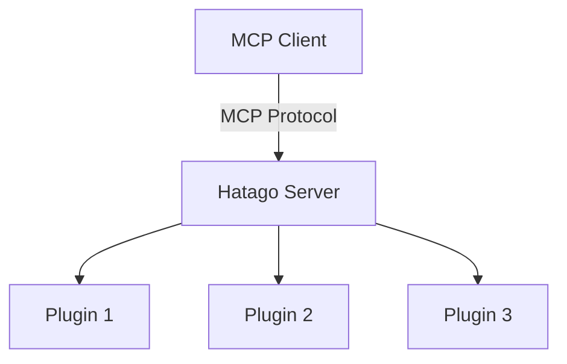
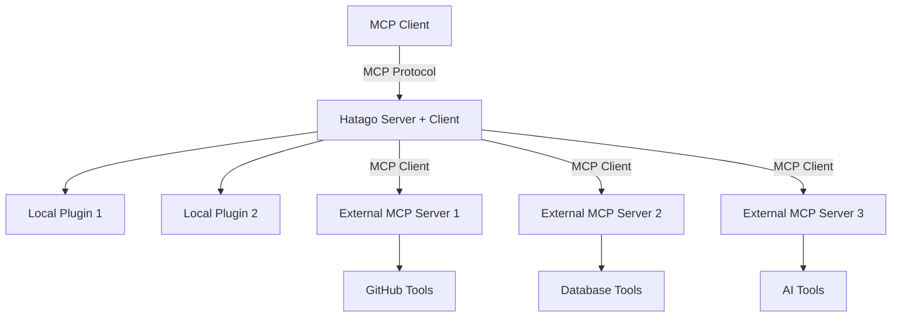

# MCP Client Integration Specification

## Overview

This specification defines how Hatago can act as an MCP client to integrate with external MCP servers, enabling seamless federation of MCP capabilities across different servers. This allows Hatago to consume tools and resources from other MCP servers while presenting a unified interface to clients.

## Table of Contents

- [Architecture Overview](#architecture-overview)
- [MCP Client Interface](#mcp-client-interface)
- [Integration Patterns](#integration-patterns)
- [Configuration Schema](#configuration-schema)
- [Implementation Details](#implementation-details)
- [Security Considerations](#security-considerations)
- [Error Handling](#error-handling)
- [Performance Optimization](#performance-optimization)
- [Testing Strategy](#testing-strategy)
- [Migration Path](#migration-path)

## Architecture Overview

### Current State

Hatago currently operates primarily as an MCP server with limited client capabilities:



### Target Architecture

Enhanced Hatago with full MCP client capabilities:



### Federation Model

Hatago acts as a federation hub, aggregating capabilities from multiple MCP servers:

1. **Proxy Mode**: Forward requests to external servers
2. **Aggregate Mode**: Combine results from multiple servers
3. **Cache Mode**: Cache responses for performance
4. **Transform Mode**: Adapt interfaces between servers

## MCP Client Interface

### Core Client API

```typescript
interface MCPClient {
  // Connection management
  connect(endpoint: string, options?: ConnectionOptions): Promise<void>
  disconnect(): Promise<void>
  isConnected(): boolean

  // Protocol methods
  initialize(params: InitializeParams): Promise<InitializeResult>
  listTools(): Promise<Tool[]>
  callTool(name: string, arguments: any): Promise<ToolResult>
  listResources(): Promise<Resource[]>
  readResource(uri: string): Promise<ResourceContents>
  subscribe(uri: string): Promise<void>
  unsubscribe(uri: string): Promise<void>

  // Event handling
  on(event: string, handler: Function): void
  off(event: string, handler: Function): void
  emit(event: string, data: any): void
}
```

### Connection Options

```typescript
interface ConnectionOptions {
  // Connection settings
  timeout?: number
  retries?: number
  retryDelay?: number

  // Authentication
  auth?: {
    type: 'bearer' | 'basic' | 'custom'
    token?: string
    username?: string
    password?: string
    headers?: Record<string, string>
  }

  // Transport configuration
  transport?: {
    type: 'http' | 'websocket' | 'stdio'
    headers?: Record<string, string>
    compression?: boolean
  }

  // Health checking
  healthCheck?: {
    enabled: boolean
    interval: number
    timeout: number
    retries: number
  }
}
```

### Tool Integration

```typescript
interface ExternalToolMapping {
  // Original tool definition from external server
  source: Tool

  // How to present it locally
  localName?: string
  namespace?: string
  description?: string

  // Parameter transformation
  parameterMapping?: Record<string, string>
  parameterDefaults?: Record<string, any>

  // Response transformation
  responseMapping?: (result: ToolResult) => ToolResult

  // Caching configuration
  cache?: {
    enabled: boolean
    ttl: number
    key: (args: any) => string
  }
}
```

## Integration Patterns

### Pattern 1: Direct Proxy

Simple forwarding of requests to external MCP server:

```typescript
class DirectProxyIntegration implements MCPIntegration {
  constructor(
    private client: MCPClient,
    private config: ProxyConfig
  ) {}

  async integrateTools(server: MCPServer): Promise<void> {
    const tools = await this.client.listTools()

    for (const tool of tools) {
      const localName = this.config.namespace ? `${this.config.namespace}.${tool.name}` : tool.name

      server.registerTool(
        {
          name: localName,
          description: tool.description,
          inputSchema: tool.inputSchema,
        },
        async args => {
          return await this.client.callTool(tool.name, args)
        }
      )
    }
  }
}
```

### Pattern 2: Aggregated Results

Combine results from multiple MCP servers:

```typescript
class AggregatedIntegration implements MCPIntegration {
  constructor(
    private clients: MCPClient[],
    private config: AggregationConfig
  ) {}

  async registerSearchTool(server: MCPServer): Promise<void> {
    server.registerTool(
      {
        name: 'search_all',
        description: 'Search across all connected MCP servers',
        inputSchema: {
          type: 'object',
          properties: {
            query: { type: 'string' },
            sources: { type: 'array', items: { type: 'string' } },
          },
        },
      },
      async ({ query, sources }) => {
        const results = await Promise.allSettled(
          this.clients
            .filter(client => !sources || sources.includes(client.id))
            .map(client => this.searchClient(client, query))
        )

        const combined = results
          .filter((result): result is PromiseFulfilledResult<any> => result.status === 'fulfilled')
          .flatMap(result => result.value)

        return {
          content: [
            {
              type: 'text',
              text: JSON.stringify(combined, null, 2),
            },
          ],
        }
      }
    )
  }
}
```

### Pattern 3: Intelligent Routing

Route requests to appropriate servers based on capabilities:

```typescript
class IntelligentRoutingIntegration implements MCPIntegration {
  private toolRegistry: Map<string, MCPClient> = new Map()
  private capabilityMap: Map<string, string[]> = new Map()

  async registerRoutedTool(server: MCPServer): Promise<void> {
    server.registerTool(
      {
        name: 'smart_execute',
        description: 'Execute tool using the best available server',
        inputSchema: {
          type: 'object',
          properties: {
            intent: { type: 'string' },
            parameters: { type: 'object' },
          },
        },
      },
      async ({ intent, parameters }) => {
        const bestClient = this.findBestClient(intent)
        const tool = this.findBestTool(bestClient, intent)

        return await bestClient.callTool(tool.name, parameters)
      }
    )
  }

  private findBestClient(intent: string): MCPClient {
    // AI-powered client selection based on intent
    // Could use similarity search, capability matching, etc.
  }
}
```

### Pattern 4: Cached Integration

Cache responses for performance:

```typescript
class CachedIntegration implements MCPIntegration {
  private cache: Map<string, { data: any; expires: number }> = new Map()

  async registerCachedTool(server: MCPServer, client: MCPClient, tool: Tool): Promise<void> {
    server.registerTool(
      {
        name: tool.name,
        description: tool.description,
        inputSchema: tool.inputSchema,
      },
      async args => {
        const cacheKey = this.generateCacheKey(tool.name, args)
        const cached = this.cache.get(cacheKey)

        if (cached && cached.expires > Date.now()) {
          return cached.data
        }

        const result = await client.callTool(tool.name, args)

        // Cache for 5 minutes
        this.cache.set(cacheKey, {
          data: result,
          expires: Date.now() + 5 * 60 * 1000,
        })

        return result
      }
    )
  }
}
```

## Configuration Schema

### External Server Configuration

```typescript
interface ExternalMCPServerConfig {
  // Server identification
  id: string
  name?: string
  description?: string

  // Connection details
  endpoint: string
  transport: 'http' | 'websocket' | 'stdio'

  // Authentication
  auth?: {
    type: 'bearer' | 'basic' | 'custom'
    token?: string
    username?: string
    password?: string
    headers?: Record<string, string>
  }

  // Integration settings
  integration: {
    pattern: 'proxy' | 'aggregate' | 'route' | 'cache'
    namespace?: string
    priority?: number

    // Tool filtering
    tools?: {
      include?: string[]
      exclude?: string[]
      rename?: Record<string, string>
    }

    // Resource filtering
    resources?: {
      include?: string[]
      exclude?: string[]
      rename?: Record<string, string>
    }
  }

  // Performance settings
  connection?: {
    timeout?: number
    retries?: number
    retryDelay?: number
    poolSize?: number
  }

  // Caching
  cache?: {
    enabled: boolean
    ttl?: number
    maxSize?: number
    strategy?: 'lru' | 'ttl' | 'custom'
  }

  // Health monitoring
  healthCheck?: {
    enabled: boolean
    interval: number
    timeout: number
    retries: number
    failureThreshold?: number
  }
}
```

### Federation Configuration

```typescript
interface MCPFederationConfig {
  // Global settings
  enabled: boolean
  mode: 'development' | 'production'

  // External servers
  servers: ExternalMCPServerConfig[]

  // Conflict resolution
  conflictResolution: {
    strategy: 'error' | 'warn' | 'ignore' | 'merge'
    namespaceStrategy: 'prefix' | 'suffix' | 'hash'
    precedence?: string[] // Server IDs in order of precedence
  }

  // Performance
  performance: {
    maxConcurrentRequests: number
    requestTimeout: number
    connectionPoolSize: number
    retryConfig: {
      attempts: number
      backoffStrategy: 'exponential' | 'linear' | 'fixed'
      maxDelay: number
    }
  }

  // Monitoring
  monitoring: {
    enabled: boolean
    metricsEndpoint?: string
    logLevel: 'error' | 'warn' | 'info' | 'debug'
    tracing?: {
      enabled: boolean
      endpoint?: string
      service: string
    }
  }
}
```

## Implementation Details

### MCP Client Implementation

```typescript
class HatagoMCPClient implements MCPClient {
  private transport: MCPTransport
  private connected: boolean = false
  private tools: Map<string, Tool> = new Map()
  private resources: Map<string, Resource> = new Map()
  private eventEmitter: EventEmitter = new EventEmitter()

  constructor(private config: ConnectionOptions) {
    this.transport = this.createTransport(config.transport?.type || 'http')
  }

  async connect(endpoint: string): Promise<void> {
    try {
      await this.transport.connect(endpoint)

      // Initialize MCP session
      const initResult = await this.initialize({
        protocolVersion: '2025-06-18',
        capabilities: {
          tools: { listChanged: true },
          resources: { subscribe: true, listChanged: true },
        },
        clientInfo: {
          name: 'hatago-mcp-client',
          version: '1.0.0',
        },
      })

      this.connected = true
      this.eventEmitter.emit('connected', initResult)

      // Load available tools and resources
      await this.refreshCapabilities()
    } catch (error) {
      this.eventEmitter.emit('error', error)
      throw error
    }
  }

  async listTools(): Promise<Tool[]> {
    if (!this.connected) {
      throw new Error('Not connected to MCP server')
    }

    const response = await this.transport.request({
      jsonrpc: '2.0',
      id: this.generateId(),
      method: 'tools/list',
    })

    if (response.error) {
      throw new Error(`MCP Error: ${response.error.message}`)
    }

    const tools = response.result.tools
    tools.forEach(tool => this.tools.set(tool.name, tool))

    return tools
  }

  async callTool(name: string, args: any): Promise<ToolResult> {
    if (!this.connected) {
      throw new Error('Not connected to MCP server')
    }

    const tool = this.tools.get(name)
    if (!tool) {
      throw new Error(`Tool not found: ${name}`)
    }

    // Validate arguments against schema
    this.validateArguments(args, tool.inputSchema)

    const response = await this.transport.request({
      jsonrpc: '2.0',
      id: this.generateId(),
      method: 'tools/call',
      params: {
        name,
        arguments: args,
      },
    })

    if (response.error) {
      throw new Error(`Tool execution failed: ${response.error.message}`)
    }

    return response.result
  }

  private createTransport(type: string): MCPTransport {
    switch (type) {
      case 'http':
        return new HTTPTransport(this.config)
      case 'websocket':
        return new WebSocketTransport(this.config)
      case 'stdio':
        return new StdioTransport(this.config)
      default:
        throw new Error(`Unsupported transport type: ${type}`)
    }
  }
}
```

### Transport Layer

```typescript
interface MCPTransport {
  connect(endpoint: string): Promise<void>
  disconnect(): Promise<void>
  request(message: any): Promise<any>
  subscribe(handler: (message: any) => void): void
}

class HTTPTransport implements MCPTransport {
  constructor(private config: ConnectionOptions) {}

  async connect(endpoint: string): Promise<void> {
    this.endpoint = endpoint

    // Test connection
    const response = await fetch(`${endpoint}/health`, {
      timeout: this.config.timeout || 5000,
      headers: this.getAuthHeaders(),
    })

    if (!response.ok) {
      throw new Error(`Connection failed: ${response.statusText}`)
    }
  }

  async request(message: any): Promise<any> {
    const response = await fetch(this.endpoint, {
      method: 'POST',
      headers: {
        'Content-Type': 'application/json',
        ...this.getAuthHeaders(),
      },
      body: JSON.stringify(message),
      timeout: this.config.timeout || 30000,
    })

    if (!response.ok) {
      throw new Error(`HTTP Error: ${response.status} ${response.statusText}`)
    }

    return await response.json()
  }

  private getAuthHeaders(): Record<string, string> {
    const headers: Record<string, string> = {}

    if (this.config.auth) {
      switch (this.config.auth.type) {
        case 'bearer':
          headers.Authorization = `Bearer ${this.config.auth.token}`
          break
        case 'basic':
          const credentials = btoa(`${this.config.auth.username}:${this.config.auth.password}`)
          headers.Authorization = `Basic ${credentials}`
          break
        case 'custom':
          Object.assign(headers, this.config.auth.headers)
          break
      }
    }

    return headers
  }
}
```

### Integration Manager

```typescript
class MCPIntegrationManager {
  private clients: Map<string, MCPClient> = new Map()
  private integrations: MCPIntegration[] = []
  private healthChecker: HealthChecker

  constructor(private config: MCPFederationConfig) {
    this.healthChecker = new HealthChecker(config.monitoring)
  }

  async initialize(server: MCPServer): Promise<void> {
    // Connect to all external servers
    for (const serverConfig of this.config.servers) {
      await this.connectToServer(serverConfig)
    }

    // Set up integrations
    await this.setupIntegrations(server)

    // Start health monitoring
    if (this.config.monitoring.enabled) {
      this.healthChecker.start()
    }
  }

  private async connectToServer(config: ExternalMCPServerConfig): Promise<void> {
    const client = new HatagoMCPClient({
      timeout: config.connection?.timeout,
      retries: config.connection?.retries,
      auth: config.auth,
      transport: { type: config.transport },
    })

    try {
      await client.connect(config.endpoint)
      this.clients.set(config.id, client)

      // Set up health monitoring
      if (config.healthCheck?.enabled) {
        this.healthChecker.monitor(config.id, client)
      }
    } catch (error) {
      console.error(`Failed to connect to MCP server ${config.id}:`, error)

      if (this.config.conflictResolution.strategy === 'error') {
        throw error
      }
    }
  }

  private async setupIntegrations(server: MCPServer): Promise<void> {
    for (const [serverId, client] of this.clients) {
      const serverConfig = this.config.servers.find(s => s.id === serverId)
      if (!serverConfig) continue

      let integration: MCPIntegration

      switch (serverConfig.integration.pattern) {
        case 'proxy':
          integration = new DirectProxyIntegration(client, serverConfig)
          break
        case 'aggregate':
          integration = new AggregatedIntegration([client], serverConfig)
          break
        case 'route':
          integration = new IntelligentRoutingIntegration()
          break
        case 'cache':
          integration = new CachedIntegration()
          break
        default:
          integration = new DirectProxyIntegration(client, serverConfig)
      }

      await integration.integrate(server, client, serverConfig)
      this.integrations.push(integration)
    }
  }
}
```

## Security Considerations

### Authentication and Authorization

1. **Token Management**

   ```typescript
   interface SecureTokenManager {
     getToken(serverId: string): Promise<string>
     refreshToken(serverId: string): Promise<string>
     revokeToken(serverId: string): Promise<void>
   }
   ```

2. **Request Validation**
   - Validate all outgoing requests
   - Sanitize parameters
   - Check response integrity

3. **Network Security**
   - Use HTTPS for all communications
   - Validate SSL certificates
   - Implement certificate pinning

### Input Sanitization

```typescript
class RequestSanitizer {
  sanitizeToolCall(name: string, args: any): any {
    // Remove potentially dangerous parameters
    const sanitized = { ...args }

    // Remove system-level parameters
    delete sanitized.__proto__
    delete sanitized.constructor

    // Validate parameter types
    return this.validateTypes(sanitized)
  }

  private validateTypes(obj: any): any {
    // Type validation logic
  }
}
```

### Rate Limiting

```typescript
class RateLimiter {
  private limits: Map<string, TokenBucket> = new Map()

  async checkLimit(serverId: string, operation: string): Promise<boolean> {
    const key = `${serverId}:${operation}`
    const bucket = this.limits.get(key) || this.createBucket(key)

    return bucket.consume()
  }

  private createBucket(key: string): TokenBucket {
    // Create rate limiting bucket
  }
}
```

## Error Handling

### Error Categories

1. **Connection Errors**
   - Network timeouts
   - Connection refused
   - SSL/TLS errors

2. **Protocol Errors**
   - Invalid MCP messages
   - Unsupported protocol versions
   - Capability mismatches

3. **Application Errors**
   - Tool execution failures
   - Resource access errors
   - Permission denied

### Error Recovery Strategies

```typescript
class ErrorRecoveryManager {
  async handleError(error: MCPError, context: ErrorContext): Promise<void> {
    switch (error.type) {
      case 'CONNECTION_ERROR':
        await this.handleConnectionError(error, context)
        break
      case 'PROTOCOL_ERROR':
        await this.handleProtocolError(error, context)
        break
      case 'APPLICATION_ERROR':
        await this.handleApplicationError(error, context)
        break
    }
  }

  private async handleConnectionError(error: MCPError, context: ErrorContext): Promise<void> {
    // Implement exponential backoff retry
    const delay = Math.min(1000 * Math.pow(2, context.retryCount), 30000)

    setTimeout(async () => {
      try {
        await context.client.reconnect()
      } catch (retryError) {
        if (context.retryCount < 5) {
          context.retryCount++
          await this.handleConnectionError(error, context)
        } else {
          // Mark server as unavailable
          this.markServerUnavailable(context.serverId)
        }
      }
    }, delay)
  }
}
```

## Performance Optimization

### Connection Pooling

```typescript
class ConnectionPool {
  private pools: Map<string, MCPClient[]> = new Map()
  private config: ConnectionPoolConfig

  async getClient(serverId: string): Promise<MCPClient> {
    const pool = this.pools.get(serverId) || []

    // Find available client
    const available = pool.find(client => client.isIdle())
    if (available) {
      return available
    }

    // Create new client if under limit
    if (pool.length < this.config.maxSize) {
      const client = await this.createClient(serverId)
      pool.push(client)
      this.pools.set(serverId, pool)
      return client
    }

    // Wait for available client
    return this.waitForAvailable(serverId)
  }
}
```

### Response Caching

```typescript
class ResponseCache {
  private cache: LRUCache<string, CachedResponse>

  constructor(config: CacheConfig) {
    this.cache = new LRUCache({
      max: config.maxSize,
      ttl: config.ttl,
    })
  }

  async get(key: string): Promise<any | null> {
    const cached = this.cache.get(key)
    if (cached && !this.isExpired(cached)) {
      return cached.data
    }
    return null
  }

  set(key: string, data: any, ttl?: number): void {
    this.cache.set(key, {
      data,
      timestamp: Date.now(),
      ttl: ttl || this.defaultTtl,
    })
  }
}
```

### Request Batching

```typescript
class RequestBatcher {
  private batches: Map<string, BatchRequest[]> = new Map()
  private timers: Map<string, NodeJS.Timeout> = new Map()

  async addRequest(serverId: string, request: MCPRequest): Promise<any> {
    return new Promise((resolve, reject) => {
      const batch = this.batches.get(serverId) || []
      batch.push({ request, resolve, reject })
      this.batches.set(serverId, batch)

      // Set timer for batch execution
      if (!this.timers.has(serverId)) {
        const timer = setTimeout(() => {
          this.executeBatch(serverId)
        }, this.batchDelay)
        this.timers.set(serverId, timer)
      }
    })
  }

  private async executeBatch(serverId: string): Promise<void> {
    const batch = this.batches.get(serverId) || []
    if (batch.length === 0) return

    this.batches.delete(serverId)
    this.timers.delete(serverId)

    // Execute batch request
    try {
      const results = await this.sendBatchRequest(serverId, batch)
      batch.forEach((item, index) => {
        item.resolve(results[index])
      })
    } catch (error) {
      batch.forEach(item => item.reject(error))
    }
  }
}
```

## Testing Strategy

### Unit Tests

```typescript
describe('MCPClient', () => {
  let client: MCPClient
  let mockTransport: jest.Mocked<MCPTransport>

  beforeEach(() => {
    mockTransport = createMockTransport()
    client = new HatagoMCPClient({ transport: mockTransport })
  })

  it('should connect successfully', async () => {
    mockTransport.connect.mockResolvedValueOnce(undefined)

    await client.connect('http://localhost:3000/mcp')

    expect(mockTransport.connect).toHaveBeenCalledWith('http://localhost:3000/mcp')
    expect(client.isConnected()).toBe(true)
  })

  it('should list tools', async () => {
    const mockTools = [{ name: 'test-tool', description: 'Test tool', inputSchema: {} }]

    mockTransport.request.mockResolvedValueOnce({
      result: { tools: mockTools },
    })

    const tools = await client.listTools()

    expect(tools).toEqual(mockTools)
  })
})
```

### Integration Tests

```typescript
describe('MCP Integration', () => {
  let testServer: MCPTestServer
  let hatago: HatagoServer

  beforeAll(async () => {
    testServer = new MCPTestServer()
    await testServer.start(3001)

    hatago = new HatagoServer({
      federation: {
        enabled: true,
        servers: [
          {
            id: 'test-server',
            endpoint: 'http://localhost:3001/mcp',
            integration: { pattern: 'proxy' },
          },
        ],
      },
    })
    await hatago.start()
  })

  afterAll(async () => {
    await hatago.stop()
    await testServer.stop()
  })

  it('should proxy tools from external server', async () => {
    const response = await fetch('http://localhost:8787/mcp', {
      method: 'POST',
      headers: { 'Content-Type': 'application/json' },
      body: JSON.stringify({
        jsonrpc: '2.0',
        id: 1,
        method: 'tools/list',
      }),
    })

    const result = await response.json()
    expect(result.result.tools).toContainEqual(
      expect.objectContaining({ name: 'test-server.external-tool' })
    )
  })
})
```

### Load Testing

```typescript
describe('MCP Federation Performance', () => {
  it('should handle concurrent requests', async () => {
    const concurrency = 100
    const requests = Array(concurrency)
      .fill(0)
      .map((_, i) => callTool('test-tool', { input: `test-${i}` }))

    const start = Date.now()
    const results = await Promise.allSettled(requests)
    const duration = Date.now() - start

    const successful = results.filter(r => r.status === 'fulfilled').length
    const failed = results.filter(r => r.status === 'rejected').length

    expect(successful).toBeGreaterThan(concurrency * 0.95) // 95% success rate
    expect(duration).toBeLessThan(5000) // Under 5 seconds
  })
})
```

## Migration Path

### Phase 1: Basic Client Support

1. Implement core MCP client interface
2. Add HTTP transport support
3. Basic proxy integration pattern
4. Simple configuration schema

### Phase 2: Advanced Features

1. WebSocket transport support
2. Caching layer
3. Health monitoring
4. Error recovery mechanisms

### Phase 3: Optimization

1. Connection pooling
2. Request batching
3. Intelligent routing
4. Performance monitoring

### Phase 4: Federation

1. Multi-server aggregation
2. Conflict resolution
3. Load balancing
4. Advanced caching strategies

## Conclusion

This specification provides a comprehensive foundation for MCP client integration in Hatago. By implementing these capabilities, Hatago can act as a federation hub for MCP servers, enabling powerful compositions of MCP capabilities while maintaining security, performance, and reliability.

The phased approach ensures incremental delivery of value while building toward a sophisticated MCP federation platform that can scale to support large ecosystems of interconnected MCP servers.

---

_This specification is version 1.0 and will evolve based on implementation experience and community feedback._
